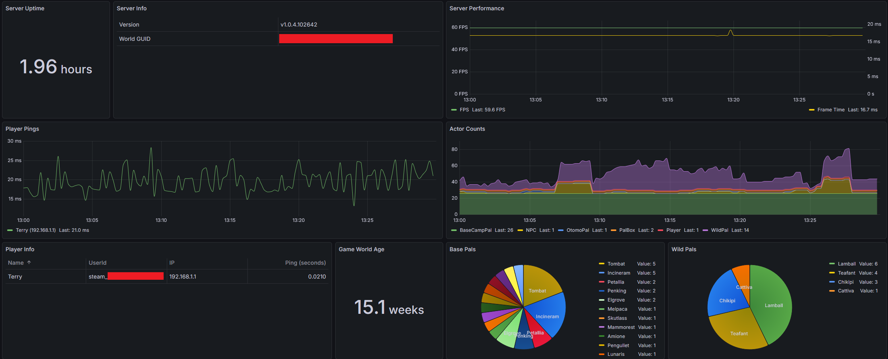

# About

A fan-made hobby project, not officially associated with Palworld or Pocketpair.

`PalServerMetricsExporter` is a console application for ingesting metrics from a Palworld dedicated server's REST API, and then exporting those metrics in a format compatible with [Prometheus](https://prometheus.io) metrics scraping.

The Palworld server REST API is officially documented here: https://docs.palworldgame.com/category/rest-api/

NOTE: Palworld's REST API is not enabled by default. See the official documentation's [configuration guide](https://docs.palworldgame.com/settings-and-operation/configuration) for details.

# Usage

A container image for this application is built and published by the repository's actions/workflows.

*Most of the command-line options shown in this example are optional, and have reasonable default values.*

```sh
docker run --rm \
    -p 8213:8213 \
    ghcr.io/tsuereth/palserver-metrics-exporter:latest \
    --palserver-host=localhost \
    --palserver-port=8212 \
    --palserver-admin-password=MyAdminPassword \
    --export-bind-port=8213 \
    --export-bind-path=/metrics
```

If this application is able to retrieve server metrics successfully, it will then publish Prometheus metrics at the configured port and path, for example `http://localhost:8213/metrics`

```
# HELP palserver_info Server info
# TYPE palserver_info gauge
palserver_current_player_num{server_version="v1.0.4.102642",world_guid="1FBDF24927C44861849C2C57868607AC"} 1
# HELP palserver_current_player_num The current number of players connected
# TYPE palserver_current_player_num gauge
palserver_current_player_num 0
# HELP palserver_server_fps The server's current runtime frames per second
# TYPE palserver_server_fps gauge
palserver_server_fps 59
# HELP palserver_server_frame_time_seconds The server's processing time between frames
# TYPE palserver_server_frame_time_seconds gauge
palserver_server_frame_time_seconds 0.016788549423217773
# HELP palserver_days The number of in-game days which have passed in the server's game world
# TYPE palserver_days gauge
palserver_days 11
# HELP palserver_max_player_num The maximum amount of players allowed on the server
# TYPE palserver_max_player_num gauge
palserver_max_player_num 32
# HELP palserver_base_camp_num The current number of base camps
# TYPE palserver_base_camp_num gauge
palserver_base_camp_num 0
# HELP palserver_uptime_seconds The server's uptime
# TYPE palserver_uptime_seconds gauge
palserver_uptime_seconds 8
...
```

## Build from source

The sources in this repository can be compiled into an executable application using [the .NET SDK](https://dotnet.microsoft.com/download).

*In this example, the `dotnet publish` command automatically retrieves external dependencies.*

```sh
dotnet publish PalServerMetricsExporter/PalServerMetricsExporter.csproj \
    --runtime linux-x64 \
    --output publish_output

./publish_output/PalServerMetricsExporter --help
```

# Command-line options

## PalServer API

These options control how `PalServerMetricsExporter` connects to a target Palworld server.

- `--palserver-host=` (default: `localhost`) sets the hostname or IP address of the target Palworld server.
- `--palserver-port=` (default: `8212`) sets the TCP port of the target Palworld server.
- `--palserver-admin-password=` (default: unset) sets the password for HTTP requests to the Palworld server's REST API.
  - Use this option instead of the file option if its value, the server's AdminPassword, is reasonably secure.
- `--palserver-admin-password-file=` (default: unset) sets the path to a text file which contains the password for HTTP requests to the Palworld server's REST API.
  - Use this option to provide the server's AdminPassword in a secret file, to avoid revealing it on the command-line.

The Palworld server's REST API requires HTTP Basic authentication. The username is always "admin" while the password is the server's "AdminPassword" as configured in its `PalWorldSettings.ini` file.

## API data detail

- `--include-player-data=` (default: `true`) sets whether or not individual player data is included in exported metrics.
  - Player data includes platform-specific account names and identifiers which might be considered sensitive.
- `--ignore-zero-ping-players=` (default: `true`) sets whether or not a player with zero ping will be ignored when exporting metrics.
  - As players are connecting to and loading the server's game world, their metadata is incomplete; ignoring reports with a ping of 0 should exclude that incomplete data.
- `--include-server-settings=` (default: `true`) sets whether or not server settings are included in exported metrics.
  - Not all server settings will be exported, only settings which are considered relevant to server performance and/or monitoring.
  - These settings will not generally change while a server is running, but recording those settings alongside other metrics could assist in later performance analysis.

## Update frequency

- `--update-interval-seconds=` (default: `15`) sets the time period inbetween fetching updated metrics from the Palworld server.
  - Each "update" will issue multiple requests to the Palworld server's REST API.
  - Calibrate this setting along with server performance and with the downstream Prometheus collector's scrape interval.

## Exporter

- `--export-bind-host=` (default: `0.0.0.0`) sets the hostname or IP address on which this application exports metrics.
- `--export-bind-port=` (default: `8213`) sets the TCP port on which this application exports metrics.
- `--export-path=` (default: `/metrics`) sets the HTTP request path at which this application exports metrics.

# Integration

A Prometheus collector can scrape this application's exported metrics according to the export options described above.

This example Prometheus configuration snippet leverages Prometheus's default `metrics_path: /metrics` setting.

```yaml
...

scrape_configs:
  - job_name: palserver
    static_configs:
      - targets: ["localhost:8213"]
```

With the exported metrics being collected and recorded by Prometheus, a visualization tool such as [Grafana](https://grafana.com) can use it as a data source and render informative charts.

An example Grafana dashboard configuration is kept in [grafana-example.json](grafana-example.json)

*This example was made using Grafana v12.3.1*



**NOTE**: Server host metrics, such as CPU and memory usage, are also crucial for a server operator to monitor. Host metrics are beyond the scope of this application.
