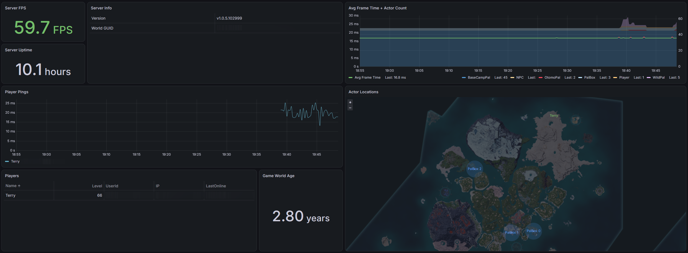

# About

A fan-made hobby project, not officially associated with Palworld or Pocketpair.

`PalServerMetricsExporter` is a console application for ingesting metrics from a Palworld dedicated server's REST API, and then exporting those metrics in a format compatible with [Prometheus](https://prometheus.io) metrics scraping.

The Palworld server REST API is officially documented here: https://docs.palworldgame.com/category/rest-api/

NOTE: Palworld's REST API is not enabled by default. See the official documentation's [configuration guide](https://docs.palworldgame.com/settings-and-operation/configuration) for details.

# Usage

A container image for this application is built and published by the repository's actions/workflows.

*Most of the command-line options shown in this example are optional, and have reasonable default values.*

```sh
docker run --rm \
    -p 8213:8213 \
    -v /local/path/to/worldmap.png:/worldmap.png \
    ghcr.io/tsuereth/palserver-metrics-exporter:latest \
    --palserver-host=localhost \
    --palserver-port=8212 \
    --palserver-admin-password=MyAdminPassword \
    --source-map-file=/worldmap.png \
    --bind-port=8213 \
    --serve-metrics-path=/metrics \
    --serve-map-path=/map
```

If this application is able to retrieve server metrics successfully, it will then publish Prometheus metrics at the configured port and path, for example `http://localhost:8213/metrics`

```
# HELP palserver_info Server info
# TYPE palserver_info gauge
palserver_info{server_version="v1.0.4.102642",world_guid="1FBDF24927C44861849C2C57868607AC"} 1
# HELP palserver_current_player_num The current number of players connected
# TYPE palserver_current_player_num gauge
palserver_current_player_num 1
# HELP palserver_server_fps The server's current runtime frames per second
# TYPE palserver_server_fps gauge
palserver_server_fps 59.592323303222656
# HELP palserver_server_frame_time_seconds The server's processing time between frames
# TYPE palserver_server_frame_time_seconds gauge
palserver_server_frame_time_seconds 0.01675912666320801
# HELP palserver_world_age_seconds The amount of time which has passed in the server's game world
# TYPE palserver_world_age_seconds gauge
palserver_world_age_seconds 9328860
# HELP palserver_max_player_num The maximum amount of players allowed on the server
# TYPE palserver_max_player_num gauge
palserver_max_player_num 32
# HELP palserver_base_camp_num The current number of base camps
# TYPE palserver_base_camp_num gauge
palserver_base_camp_num 2
# HELP palserver_uptime_seconds The server's uptime
# TYPE palserver_uptime_seconds gauge
palserver_uptime_seconds 11299
...
```

## Build from source

The sources in this repository can be compiled into an executable application using [the .NET SDK](https://dotnet.microsoft.com/download).

*In this example, the `dotnet publish` command automatically retrieves external dependencies.*

```sh
dotnet publish PalServerMetricsExporter/PalServerMetricsExporter.csproj \
    --runtime linux-x64 \
    --output publish_output

./publish_output/PalServerMetricsExporter --help
```

# Command-line options

## General

- `--help` will print the application's help text, then exit.
- `--version` will print the application's build version, then exit.
- `--handle-sigterm` will enable an optional SIGTERM handler, which attempts to gracefully stop the application when SIGTERM is received.

## PalServer API

These options control how `PalServerMetricsExporter` connects to a target Palworld server.

- `--palserver-host=` (default: `localhost`) sets the hostname or IP address of the target Palworld server.
- `--palserver-port=` (default: `8212`) sets the TCP port of the target Palworld server.
- `--palserver-admin-password=` (default: unset) sets the password for HTTP requests to the Palworld server's REST API.
  - Use this option instead of the file option if its value, the server's AdminPassword, is reasonably secure.
- `--palserver-admin-password-file=` (default: unset) sets the path to a text file which contains the password for HTTP requests to the Palworld server's REST API.
  - Use this option to provide the server's AdminPassword in a secret file, to avoid revealing it on the command-line.

The Palworld server's REST API requires HTTP Basic authentication. The username is always "admin" while the password is the server's "AdminPassword" as configured in its `PalWorldSettings.ini` file.

## API data detail

- `--include-player-data=` (default: `true`) sets whether or not individual player data is included in exported metrics.
  - Player data includes platform-specific account names and identifiers which might be considered sensitive.
- `--ignore-zero-ping-players=` (default: `true`) sets whether or not a player with zero ping will be ignored when exporting metrics.
  - As players are connecting to and loading the server's game world, their metadata is incomplete; ignoring reports with a ping of 0 should exclude that incomplete data.
- `--include-server-settings=` (default: `true`) sets whether or not server settings are included in exported metrics.
  - Not all server settings will be exported, only settings which are considered relevant to server performance and/or monitoring.
  - These settings will not generally change while a server is running, but recording those settings alongside other metrics could assist in later performance analysis.
- `--include-game-data=` (default: `false`) sets whether or not game data (world actor snapshots) are included in exported metrics.
  - Palworld servers do not provide this data by default; the `-enable-gamedata-api` server command-line option enables it.

## Update frequency

- `--update-interval-seconds=` (default: `15`) sets the time period inbetween fetching updated metrics from the Palworld server.
  - Each "update" will issue multiple requests to the Palworld server's REST API.
  - Calibrate this setting along with server performance and with the downstream Prometheus collector's scrape interval.

## Map file

- `--source-map-file=` (default: `map-default.png`) sets the path to a file which will be served in response to a map-image request.
- `--source-map-file-content-type=` (default: `image/png`) sets the MIME type which will be supplied as a Content-Type header in response to a map-image request.

## HTTP listening

- `--bind-host=` (default: `0.0.0.0`) sets the hostname or IP address on which this application serves HTTP content, including metrics and map file.
- `--bind-port=` (default: `8213`) sets the TCP port on which this application serves HTTP content, including metrics and map file.
- `--serve-metrics-path=` (default: `/metrics`) sets the HTTP request path at which this application exports metrics.
- `--serve-map-path=` (default: `/map`) sets the HTTP request path at which this application provides a map file.

# Integration

A Prometheus collector can scrape this application's exported metrics according to the export options described above.

This example Prometheus configuration snippet leverages Prometheus's default `metrics_path: /metrics` setting.

```yaml
...

scrape_configs:
  - job_name: palserver
    static_configs:
      - targets: ["localhost:8213"]
```

With the exported metrics being collected and recorded by Prometheus, a visualization tool such as [Grafana](https://grafana.com) can use it as a data source and render informative charts.

An example Grafana dashboard configuration is kept in [grafana-example.json](grafana-example.json)

*This example was made using Grafana v13.2.3*



**NOTE**: Server host metrics, such as CPU and memory usage, are also crucial for a server operator to monitor. Host metrics are beyond the scope of this application.

# Querying

## Server metadata

A special gauge named `palserver_info` with a constant value of `1` includes labels which describe metadata about the server. This metadata may be of interest when analyzing data collected from multiple game servers.

`palserver_info * on(player_user_id) group_left(player_name, player_ip) palserver_player_info`

| Labels | Value |
| - | - |
| {server_version="v1.0.4.102642", world_guid="1FBDF24927C44861849C2C57868607AC"} | 1 |

## Runtime performance

**Summary: For the best performance measurements, enable Game Data metrics and refer to the `palserver_server_average_fps` gauge.**

Gauges named `palserver_server_fps` and `palserver_server_frame_time_seconds` provide measurements of the game server's frame-rate and processing time per frame (*i.e.* the values are approximate inverses of each other).

However, the FPS and frame time measurements from Palworld's game server are instantaneous samples, and thus are liable to misrepresent server performance "blips" -- short-lived performance stutters which may occur due to sudden changes in the server simulation state, especially when a player logs in or fast-travels to a distant area.

To obtain more accurate server performance insights, the gauge `palserver_server_average_fps` is recommended instead. But note that this measurement is only available when running the Palworld server with `-enable-gamedata-api` and then using this exporter's `--include-game-data=true` option.

[Pocketpair's documentation](https://docs.palworldgame.com/api/rest-api/metrics) doesn't confirm the evaluation period of the Average FPS metric; based on ad-hoc analysis (using Palworld version v1.0.5.102999) it *appears* to be measured over a rolling time window of 15 seconds.

## Players

When a player is connected to the game server, an instance of the special gauge `palserver_player_info` will be exported with metadata identifying that player.

- `player_account_name` is the player's online platform account name, such as their Steam name or Xbox name.
- `player_id` is a unique ID created by the Palworld server for the player's save data.
  - This ID may be inconsistent while the player is still logging into and loading the game server.
- `player_ip` is the player's current client-side IP address.
- `player_name` is the name of the player's character in-game.
  - This may also be inconsistent while the player is still loading the game server.
- `player_user_id` is a unique ID generated from the player's online platform account.
  - This ID is the most consistent way to identify a player.

Other metrics for the player, such as their ping measurement, are labeled with the `player_user_id` so that the metric can be joined with player metadata. For example:

`palserver_player_ping_seconds * on(player_user_id) group_left(player_name, player_ip) palserver_player_info`

| Labels | Value |
| - | - |
| {player_ip="1.2.3.4", player_name="MyPalPlayer", player_user_id="steam_12345678"} | 0.018178571701049806 |

Note that player metrics are only exported when that player is connected; their metrics are removed from the export after they disconnect.

## Game Actors

When a Palworld server's Game Data API is enabled, this application's exported metrics can include some metrics for [actors](https://dev.epicgames.com/documentation/unreal-engine/actors-in-unreal-engine) in the game world.

Only "simulating" game actors are in the server's Game Data response, which means:

- Pals which are assigned to a base camp will always be shown, as they work on the base even when players are offline.
- Wild pals *near a player* - within the server's [ServerReplicatePawnCullDistance](https://docs.palworldgame.com/settings-and-operation/configuration/) setting - will be shown, as the game simulates those pals' activity.

Game actor data does not show any wild pals far away from players.

Exported metrics will include an instance of the special gauge `palserver_actor_info` with identifying metadata for each current game actor.

- `actor_class` is the game code's (Unreal Engine) class name, from which the actor was created.
- `actor_id` is a unique identifier for the game actor.
- `actor_name` is a mostly-human-friendly name for the actor.
  - For Player actors, this name is the player's character name.
  - For pal actors, this name is the in-game friendly name like "Melpaca" or "Pengullet" (which is not unique to the specific actor).
  - For the PalBox (base camp) actor type, this name is a hard-coded string identifying the game object, plus a number which increments for each base camp.
- `actor_type` is a type or category for the actor.
  - The [Palworld "CharacterActor"](https://docs.palworldgame.com/api/rest-api/game-data) entity may be of a type like "Player" or "NPC" or "OtomoPal" (a party-member pal).
  - The [Palworld "PalBoxActor"](https://docs.palworldgame.com/api/rest-api/game-data) entity is simply a "PalBox" type.

Similar to player metrics, a game actor's metrics are labeled with `actor_id` so that they can be joined with relevant metadata. For example:

`palserver_actor_location_x * on(actor_id) group_left(actor_name) palserver_actor_info{actor_type="PalBox"}`

| Labels | Value |
| - | - |
| {actor_id="新規生成拠点テンプレート名0(仮)", actor_name="新規生成拠点テンプレート名0(仮)"} | -357970.5 |
| {actor_id="新規生成拠点テンプレート名1(仮)", actor_name="新規生成拠点テンプレート名1(仮)"} | -365144.8125 |

Some of those game actor metadata labels can be interesting for aggregate measurements, such as to count the number of each pal currently assigned to base camps:

`sum(palserver_actor_info{actor_type="BaseCampPal"}) by(actor_name)`

| Labels | Value |
| - | - |
| {actor_name="Melpaca"} | 1 |
| {actor_name="Incineram"} | 5 |
| {actor_name="Penking"} | 2 |

# Map image and location coordinates

In addition to Prometheus metrics, this application implements an HTTP listener to serve a map image upon request. Default options will listen to the path `/map` and will respond with a simple transparent PNG image.

When `--source-map-file` specifies an alternate image file, the application thus exposes that image to downstream metric-collection and visualization tools. **The purpose of this option is to optionally support a [Grafana geomap panel](https://grafana.com/docs/grafana/latest/visualizations/panels-visualizations/visualizations/geomap/).**

Player and actor metrics include location data, which can be marked on this map.

## Providing a Palworld map file

The texture (image) used to show Palworld's map in-game can only be extracted from the purchaseable game client for Windows. It is not included in the freely-available dedicated server package.

Given that, as Palworld is built with Unreal Engine, many free community-developed tools - including but not limited to [FModel](https://github.com/4sval/FModel) and [repak](https://github.com/trumank/repak) - can be used to extract assets from the game's content package at `<game-install-dir>/Pal/Content/Paks/Pal-Windows.pak`

Within the content package, the path to Palworld's world map texture is: `Pal/Content/Pal/Texture/UI/Map/T_WorldMap.uasset`

*If a tool requires Palworld's package-mapping information in "Mappings.usmap" this is likely available from the mod-development community, such as [at NexusMods](https://www.nexusmods.com/palworld/mods/2854).*

The `T_WorldMap` texture should be easily export-able to a reusable image file. Note that the raw texture may be quite a bit larger than necessary for this application's simple visualization use-case; consider resizing the exported image to reduce application memory / bandwidth / visualization rendering load.

After exporting and/or converting an image file, this application can be configured to provide that map file (*e.g.* to support a geomap visualization) using the `--source-map-file=...` option.

If this application is being run in a Docker container, note that this option references an in-container file path, so the file must be mounted in the container with the `-v` option: `docker run ... -v /local/path/to/worldmap.png:/worldmap.png ... --source-map-file=/worldmap.png`

Finally, a [Grafana Geomap](https://grafana.com/docs/grafana/latest/visualizations/panels-visualizations/visualizations/geomap/)'s Basemap layer can be configured to reference this map image as a [custom XYZ Tile URL](https://grafana.com/docs/grafana/latest/visualizations/panels-visualizations/visualizations/geomap/#xyz-tile-layer) using this application's `---serve-map-path=...` URL, for example: `http://metrics_exporter:8213/map`

Unlike a real XYZ Tile server, this use-case provides only a single tile at a fixed zoom `Z` level and fixed `X` and `Y` position. *The basemap layer must also be configured to fix that `Z` level*; read on for more detail about positioning and location math.

## Understanding player and actor locations

This application's exported metrics include:

- `palserver_player_location_x` and `palserver_player_location_y` for each currently-connected player.
- If Game Data metrics are enabled, `palserver_actor_location_x` and `palserver_actor_location_y` for each currently-simulating actor (including connected players).

These values are taken directly from the Palworld server's API responses. They are not equal to the map coordinates seen by players in-game; they are also not correlated to intuitive meanings of X and Y coordinates.

The location "x" coordinate corresponds to the *vertical* span of Palworld's in-game map. The value increases from the bottom of the map to the top.

The location "y" coordinate corresponds to the *horizontal* span of Palworld's in-game map. The value increases from the left of the map to the right.

The value ranges of these coordinates are encoded in Palworld game assets. (See the notes above regarding map-texture asset extraction; coordinate ranges can be observed in the data table at `Pal/Content/Pal/DataTable/WorldMapUIData/DT_WorldMapUIData.uasset`.) As of Palworld version v1.0.5.102999, they are:

| Axis | Minimum | Maximum | (Calculated) Range |
| - | - | - | - |
| `location_x` (vertical) | -1099400.0 (bottom) | 349400.0 (top) | 1448800.0 |
| `location_y` (horizontal) | -724400.0 (left) | 724400.0 (right) | 1448800.0 |

***NOTE**: These coordinates are for the "Main Map" only. Palworld's end-game "Tree" area has a separate map.*

Thus to project Palworld locations onto a hypothetical square, ranging from 0.0 (bottom left) to 1.0 (top right):

`position_vertical = (location_x + 1099400.0) / 1448800.0`

`position_horizontal = (location_y + 724400.0) / 1448800.0`

Given those ranges, Palworld location coordinates can be roughly converted into geomap-compatible latitude and longitude values, by pretending that Palworld's map is equivalent to a flat projection of Earth. *However*... the [Web Mercator definition](https://en.wikipedia.org/wiki/Web_Mercator_projection), and [the Mercator projection's distortion of distance near extreme latitudes](https://en.wikipedia.org/wiki/Mercator_projection#Distortion_of_sizes), mean that such coordinate conversion becomes more mathematically convoluted (or, more inaccurate) the more of Earth is involved in this pretend equivalence.

A linear translation of Palworld location coordinates into pretend latitude and pretend longitude will be most successful when choosing a small range of latitude and longitude. For example, [according to OpenStreetMap's zoom level reference](https://wiki.openstreetmap.org/wiki/Zoom_levels), at XYZ tiles with a zoom level `Z = 8` a tile's width is approximately 1.406 degrees of longitude; and if the tile is close to the equator, its height will also be approximately 1.406 degrees of latitude.

In summary, if Palworld location coordinates are projected into a small (high zoom) XYZ tile that's near the equator (zero latitude), that projection can be linear without sacrificing meaningful accuracy. At `Z = 8`, these latitude and longitude values will range from the bottom left (0.0, 0.0) to top right (1.406, 1.406) of one tile:

`latitude = (position_vertical * 1.406) = ((location_x + 1099400.0) / 1448800.0 * 1.406)`

`longitude = (position_horizontal * 1.406) = ((location_y + 724400.0) / 1448800.0 * 1.406)`
